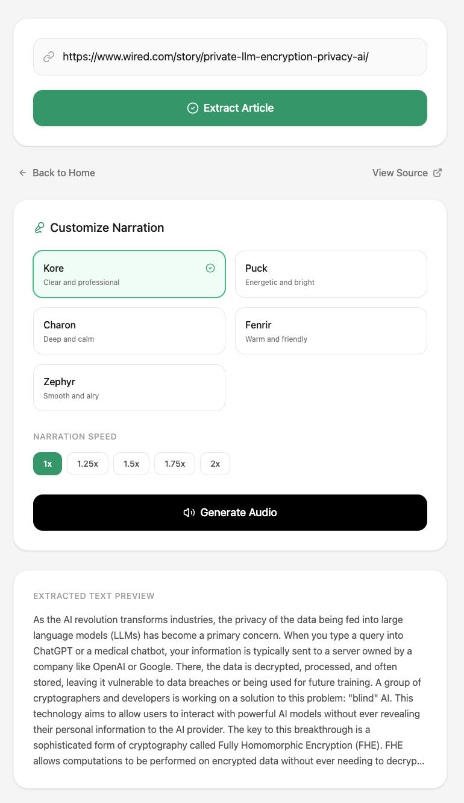

# AudioArticle 🎧

AudioArticle is a high-quality web application that transforms written articles into natural-sounding narrated audio experiences. Powered by the Gemini 2.5 Flash TTS model, it allows users to consume their favorite content while on the go.

## ✨ Features

- **Smart Article Extraction**: Automatically fetches and cleans content from any article URL using a custom Express backend with a fallback to Gemini's URL Context tool.
- **High-Quality Narration**: Uses the **Gemini 2.5 Flash TTS** model for natural, human-like speech.
- **Customizable Voices**: Choose from 5 distinct voice profiles (**Kore, Puck, Charon, Fenrir, Zephyr**) to match the article's tone.
- **Adjustable Playback Speed**: Listen at your own pace with presets ranging from **1x to 2x**.
- **Live Remaining Timer**: A real-time countdown that adjusts based on your selected playback speed.
- **Curated Suggestions**: A "Trending Now" section with recent articles from top publications like **The Verge, NYT, Wired, and Stratechery**.
- **Easy Sharing**: Integrated share functionality to quickly send article links to others.
- **Modern Responsive UI**: A clean, minimal interface built with **Tailwind CSS** and **Lucide Icons**.

## Hallucination capabilities
- The application suggests some articles to listen to. These articles are from reputed sources like The Wired, Stratechery, The Verge etc. These sources were specifically supplied as part of a prompt. 

- At first read this list looks quite good. But if we navigate to _any_ of those links, we will see:

- So the **AI hallucinated a pretty believable list of articles**. What happens if we ask it to fetch any of these links to produce an audio version?


As you can see, the **AI hallucinates the entire article!** And produces an audio version to boot.
I don't know about you but I find this absolutely fascinating.


## 🚀 Tech Stack

- **Frontend**: React, Vite, Tailwind CSS, Lucide React, Framer Motion.
- **Backend**: Node.js, Express, Cheerio (for web scraping).
- **AI Engine**: Google Gemini API (@google/genai).

## 🛠️ Getting Started

### Prerequisites

- Node.js (v18 or higher)
- A Google Gemini API Key (Get one at [ai.google.dev](https://ai.google.dev/))

### Installation

1. **Clone the repository**:
   ```bash
   git clone https://github.com/your-username/audio-article.git
   cd audio-article
   ```

2. **Install dependencies**:
   ```bash
   npm install
   ```

3. **Set up environment variables**:
   Create a `.env` file in the root directory and add your Gemini API key:
   ```env
   GEMINI_API_KEY=your_actual_api_key_here
   ```

4. **Run the development server**:
   ```bash
   npm run dev
   ```
   The app will be available at `http://localhost:3000`.

## 📦 Deployment

This app is designed to be deployed as a full-stack application.

- **Build the project**:
  ```bash
  npm run build
  ```
- **Start the production server**:
  ```bash
  npm start
  ```

## 📄 License

This project is licensed under the Apache-2.0 License.
